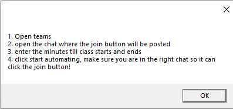
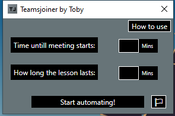
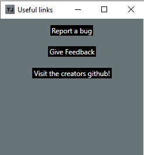

# teamsjoiner
A bot to join teams meetings when you're away, so you can be anywhere you like!

## IMPORTANT
The application will stop responding when its waiting, this is not an issue and it works that way, untill i find a better way it will stay like this.

Please also note that the application will come up as an unrecognised app, i kindly ask you to press more info-run anyway when it pops up, thanks in advance!

## How to use
here's how to use it. Again, it is supposed to be straightforward. make sure the chat is open where the meeting will be posted as this bot uses the colour of the "join" button to click it!

## The UI
The UI is designed to be user friendly too, as a creator with no knowledge of UI design at all, i'm proud. Heres a quick look:

## Useful Links
Here you can find a few links to google forms i have set up and a link to my github page, needs some work but will be updated as soon as possible!

