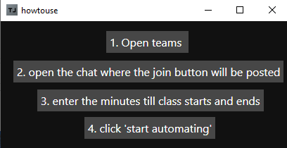
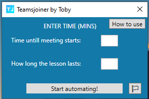

# TeamsJoiner
A bot to join teams meetings when you're away, so you can be anywhere you like! designed to be user friendly and have a "plug and play" aspect, to run you need no knowledge of coding or any experience. And most importantly, only use this when you absolutely have to. Meetings and classes are necessary for learning and organisation.

## How to use 
here's how to use it. again, it is supposed to be straightforward. make sure the chat is open where the meeting will be posted as this bot uses the colour of the "join" button to click it!

## The UI:
The UI is designed to be user friendly too, as a creator with no knowledge of UI design at all, i'm proud. Heres a quick look:

## Features
- User friendly
  - User friendly UI
  - Easy to follow steps
  - Easy to understand
  
## Credits
- Testers
  - Ronnie
  - Megan

